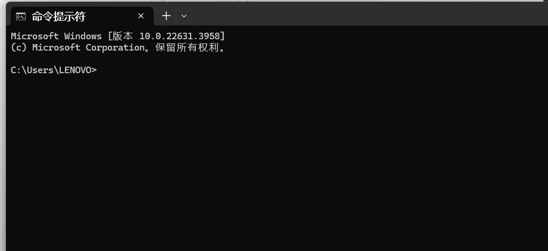
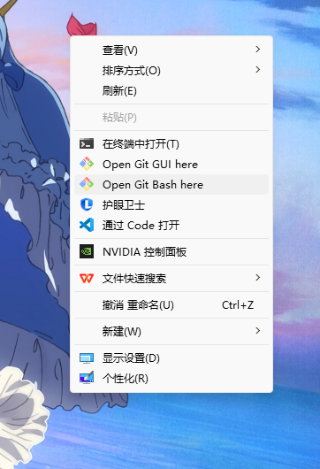
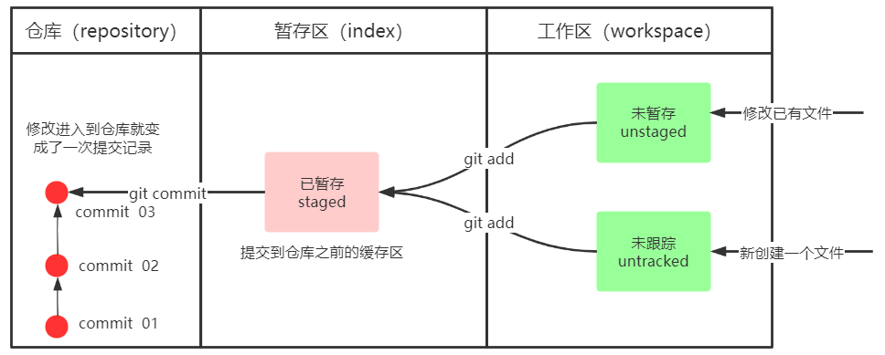
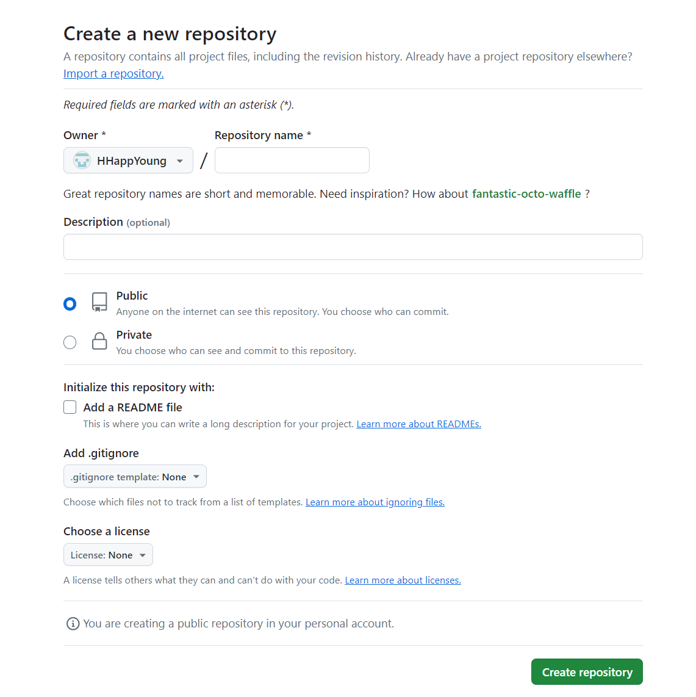
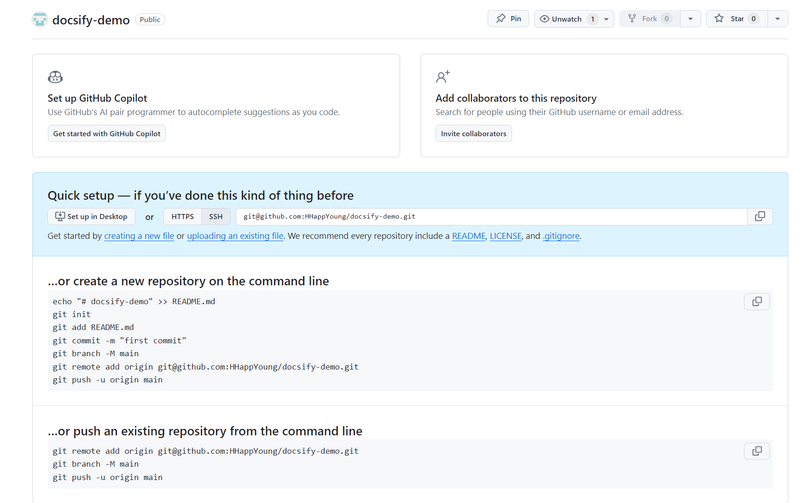
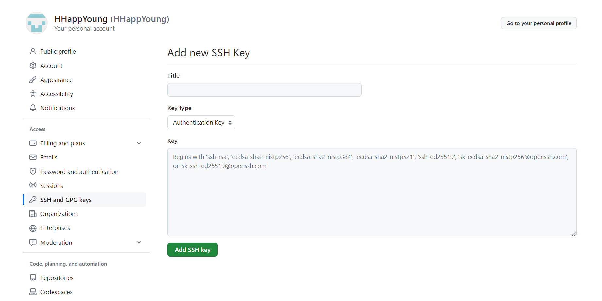
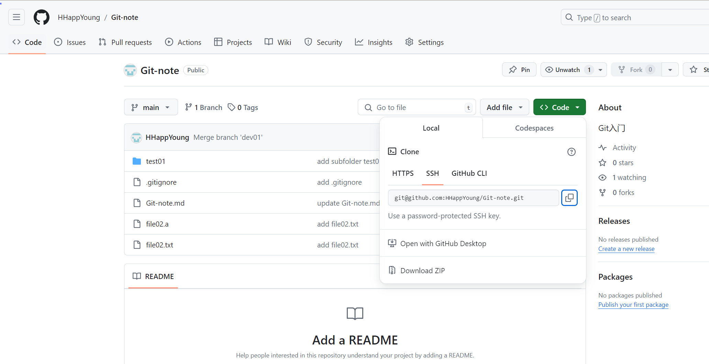
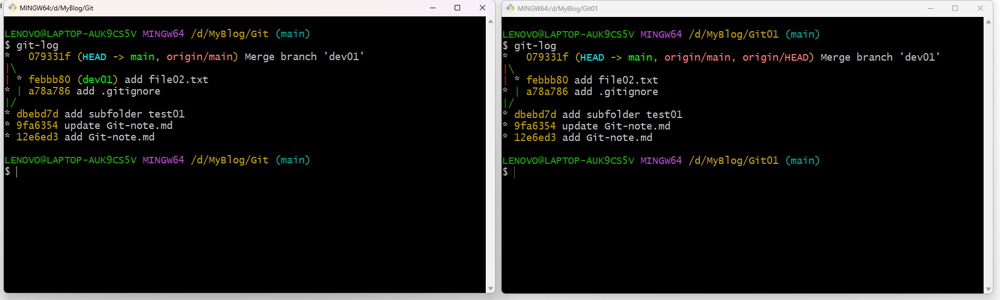
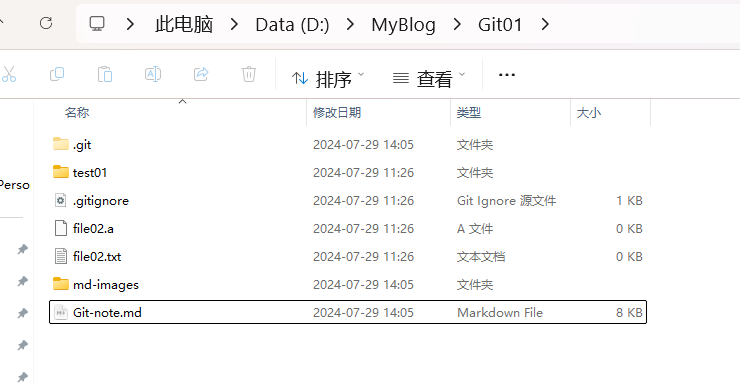
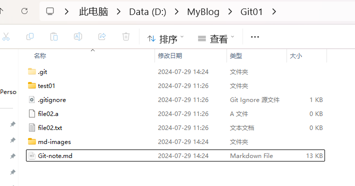

# Git学习笔记

## 1. 一些关于命令行的基本知识

一个个人电脑上只能有一个管理员账户，可以有多个用户账户。管理员账户对电脑有绝对的控制权，而普通的用户账户没有。打开windows自带的cmd，会显示当前所在的用户账户（如本机是 `LENOVO` ），这是因为cmd默认在用户目录下启动。每个用户账户都会有一个对应的用户目录用于存放配置文件（如本机是 `C:\Users\LENOVO` ）。



以下是一些常见的linux命令，在操作git bash时会用到，在此提前列举：

| 命令   | 含义                                   | 示例                                             |
| ------ | -------------------------------------- | ------------------------------------------------ |
| ls -al | 列出当前目录下的所有文件，包括隐藏文件 |                                                  |
| cat    | 查看文件内容                           |                                                  |
| touch  | 创建新文件                             | `touch file01.txt`                               |
| ~      | 家目录，即当前所在的用户目录           | `touch ~/.bashrc` 在家目录下创建.bashrc文件      |
| .      | 当前目录                               | `git add .` 把当前目录下的所有文件都提交到缓存区 |
|        |                                        |                                                  |


## 2. 版本控制工具


### 2.4 Git

#### 2.4.1 什么是Git？

Git是分布式的，Git不需要有中心服务器，我们每台电脑拥有的东西都是一样的。我们使用Git并且有个中心服务器，仅仅是为了方便交换大家的修改，但是这个服务器的地位和我们每个人的PC是一样的。我们可以把它当做一个开发者的pc就可以就是为了大家代码容易交流不关机用的。没有它大家一样可以工作，只不过“交换”修改不方便而已。

Git是一个开源的分布式版本控制系统，可以有效、高速地处理从很小到非常大的项目版本管理。Git是Linus Torvalds 为了帮助管理 Linux 内核开发而开发的一个开放源码的版本控制软件。同生活中的许多伟大事物一样，Git 诞生于一个极富纷争大举创新的年代。Linux 内核开源项目有着为数众多的参与者。 绝大多数的 Linux 内核维护工作都花在了提交补丁和保存归档的繁琐事务上（1991－2002年间）。 到 2002 年，整个项目组开始启用一个专有的分布式版本控制系统 BitKeeper 来管理和维护代码。

到了 2005 年，开发 BitKeeper 的商业公司同 Linux 内核开源社区的合作关系结束，他们收回了Linux 内核社区免费使用 BitKeeper 的权力。 这就迫使 Linux 开源社区（特别是 Linux 的缔造者Linus Torvalds）基于使用 BitKeeper 时的经验教训，开发出自己的版本系统。 他们对新的系统制订了若干目标：

- 速度

- 简单的设计

- 对非线性开发模式的强力支持（允许成千上万个并行开发的分支）

- 完全分布式

- 有能力高效管理类似 Linux 内核一样的超大规模项目（速度和数据量）

#### 2.4.2 Git的工作原理


命令如下：

1. clone（克隆）: 从远程仓库中克隆代码到本地仓库
2. checkout （检出）:从本地仓库中检出一个仓库分支然后进行修订
3. add（添加）: 在提交前先将代码提交到暂存区
4. commit（提交）: 提交到本地仓库。本地仓库中保存修改的各个历史版本
5. fetch (抓取) ： 从远程库，抓取到本地仓库，不进行任何的合并动作，一般操作比较少。
6. pull (拉取) ： 从远程库拉到本地库，自动进行合并(merge)，然后放到到工作区，相当于

fetch+merge

7. push（推送） : 修改完成后，需要和团队成员共享代码时，将代码推送到远程仓库


## 3. 基本命令

### 3.1 Git环境配置

#### 3.1.2 基本配置

（1）打开Git Bash

在桌面上右键（这个随便在什么目录下右键都行），点击 `显示更多选项`，会出现以下菜单栏，点击 `Open Git Bash here` 即可打开git bash



（2）设置用户信息（前面这个 `$` 是git bash自带的，用于标识这一行是命令，不是命令本身）

```bash
$ git config --global user.name “hhy”

$ git config --global user.email “hhy200319@gmail.com”
```

查看配置信息：

```bash
$ git config --global user.name

$ git config --global user.email
```

#### 3.1.3 为常用指令配置别名

（1）打开用户目录，创建 `.bashrc` 文件

部分windows系统不允许用户创建点号开头的文件，可以打开gitBash,执行 touch ~/.bashrc

```bash
$ touch ~/.bashrc
```

（2）用git bash安装时指定的默认编辑器（我用的是vscode，启动指令是code，不同编辑器的启动指令不同，例如vim的启动指令是vim）打开.bashrc文件（也可以右键用记事本打开编辑）：

```bash
$ code ~/.bashrc 
```

（3）在 `.bashrc` 文件中输入如下内容：

```bash
#用于输出git提交日志
alias git-log='git log --pretty=oneline --all --graph --abbrev-commit'
#用于输出当前目录所有文件及基本信息
alias ll='ls -al'
```

（4）打开git bash，执行 source ~/.bashrc，启用别名

```bash
$ source ~/.bashrc 
```

这边可能会提示你少一个和`.bashrc` 配套的文件，但不用管，它会自动帮你创建。

（5）测试别名是否能够正常使用（有正常输出即可）

```bash
$ git-log
```


### 3.2 创建本地仓库

要使用Git对我们的代码进行版本控制，首先需要获得本地仓库

1）在电脑的任意位置创建一个空目录（例如test）作为我们的本地Git仓库

2）进入这个目录中，点击右键打开Git bash窗口

3）执行命令git init

4）如果创建成功后可在文件夹下看到隐藏的.git目录。

```bash
LENOVO@LAPTOP-AUK9CS5V MINGW64 /d/MyBlog/Git
$ git init
Initialized empty Git repository in D:/MyBlog/Git/.git/

LENOVO@LAPTOP-AUK9CS5V MINGW64 /d/MyBlog/Git (main)
$ ls -al
total 4
drwxr-xr-x 1 LENOVO 197609 0 Jul 28 13:26 ./
drwxr-xr-x 1 LENOVO 197609 0 Jul 28 13:26 ../
drwxr-xr-x 1 LENOVO 197609 0 Jul 28 13:26 .git/
```


### 3.3 基础操作命令

Git工作目录下对于文件的**修改**(增加、删除、更新)会存在几个状态，这些**修改**的状态会随着我们执行Git的命令而发生变化。



#### 3.3.1 查看修改的状态（status）

- 作用：查看的修改的状态（暂存区、工作区）

- 命令形式：git status

```bash
LENOVO@LAPTOP-AUK9CS5V MINGW64 /d/MyBlog/Git (main)
$ touch Git-note.md

LENOVO@LAPTOP-AUK9CS5V MINGW64 /d/MyBlog/Git (main)
$ git status
On branch main

No commits yet

Untracked files:
  (use "git add <file>..." to include in what will be committed)
        Git-note.md

nothing added to commit but untracked files present (use "git add" to track)
```

#### 3.3.2 添加工作区到暂存区（add）

- 作用：添加工作区一个或多个文件的修改到暂存区

- 命令形式：git add 单个文件名/通配符
  - 将当前目录下的所有修改加入暂存区：git add .

```bash
LENOVO@LAPTOP-AUK9CS5V MINGW64 /d/MyBlog/Git (main)
$ git add .

LENOVO@LAPTOP-AUK9CS5V MINGW64 /d/MyBlog/Git (main)
$ git status
On branch main

No commits yet

Changes to be committed:
  (use "git rm --cached <file>..." to unstage)
        new file:   Git-note.md
```

#### 3.3.3 提交暂存区到本地仓库（commit）

- 作用：提交暂存区内容到本地仓库的当前分支

- 命令形式：git commit -m '注释内容'

```bash
LENOVO@LAPTOP-AUK9CS5V MINGW64 /d/MyBlog/Git (main)
$ git commit -m "add Git-note.md"
[main (root-commit) 12e6ed3] add Git-note.md
 1 file changed, 0 insertions(+), 0 deletions(-)
 create mode 100644 Git-note.md

LENOVO@LAPTOP-AUK9CS5V MINGW64 /d/MyBlog/Git (main)
$ git status
On branch main
nothing to commit, working tree clean
```

#### 3.3.4 查看提交日志（log）

- 作用：查看提交记录

- 命令形式：git log [option]

  - option包含如下选项

    - --all 显示所有分支

    - --pretty=oneline 将提交信息显示为一行

    - --abbrev-commit 使得输出的commitId更简短

    - --graph 以图的形式显示

```bash
LENOVO@LAPTOP-AUK9CS5V MINGW64 /d/MyBlog/Git (main)
$ git log
commit 12e6ed3390d4f1c594e28f97a63283ade0197869 (HEAD -> main)
Author: hhy <hhy200319@gmail.com>
Date:   Sun Jul 28 13:32:05 2024 +0800

    add Git-note.md
```

在 **3.1.3** 中配置的别名 `git-log` 就包含了上述可选参数，所以后续可以直接使用指令 `git-log`

#### 3.3.5 版本回退

- 作用：版本切换

- 命令形式：git reset --hard commitID
  - commitID 可以使用 git-log 或 git log 指令查看

- 如何查看已经清除（clear）的提交记录？
  - git reflog 

现在我有两条提交：

```bash
LENOVO@LAPTOP-AUK9CS5V MINGW64 /d/MyBlog/Git (main)
$ git-log
* 9fa6354 (HEAD -> main) update Git-note.md
* 12e6ed3 add Git-note.md

```

回退到第一条提交 12e6ed3 （commitID 的前7位就已经是不重复的了）

```bash
LENOVO@LAPTOP-AUK9CS5V MINGW64 /d/MyBlog/Git (main)
$ git reset --hard 12e6ed3
HEAD is now at 12e6ed3 add Git-note.md
```

此时查看文件夹 `D:\MyBlog\Git`，会发现里面的文件也相应回退到第一条提交时的状态。

如果想再回到9fa6354，只需再reset一下就行，所以这个命令其实准确地来说是在”切换“版本，而不是”回退“版本。

#### 3.3.6 添加文件至忽略列表

一般我们总会有些文件无需纳入Git 的管理，也不希望它们总出现在未跟踪文件列表。 通常都是些自动生成的文件，比如日志文件，或者编译过程中创建的临时文件等。 在这种情况下，我们可以在工作目录中创建一个名为 `.gitignore` 的文件（文件名称固定），输入要忽略的文件模式。

依次输入以下指令，会发现第一次 `git status` 的输出中没有`file02.a`，而第二次 `git status`  则会显示`file02.a`是untracked的。

```bash
$ touch file02.a
$ touch .gitignore
$ code .gitignore # 输入 *.a 并保存，表示不把 .a 文件纳入管理
$ git status # 不显示file02.a
$ rm .gitignore # 删除.gitignore文件
$ git status # 显示file02.a
```

通常，我们会对 `.gitignore` 文件做如下设置：

```bash
# no .a files
*.a
# but do track lib.a, even though you're ignoring .a files above
!lib.a
# only ignore the TODO file in the current directory, not subdir/TODO
/TODO
# ignore all files in the build/ directory
build/
# ignore doc/notes.txt, but not doc/server/arch.txt
doc/*.txt
# ignore all .pdf files in the doc/ directory
doc/**/*.pdf

```


### 3.4 分支

HEAD指明当前处于哪个分支


## 4. 远程仓库

### 4.1 常用的托管服务（远程仓库）

GitHub

### 4.2 创建远程仓库

在github上手动创建一个远程仓库，界面如下图所示。填写仓库名（Repository name）即可，Description可填可不填，选Public和Private看个人喜好，Initialize this repository with 默认即可，不要动。然后点击最下面的`Create repository`。



仓库创建完成后会出现如下界面，显示了仓库的SSH地址，例如存放本笔记的仓库的地址是 （下图是创建另一个仓库时的截图，因为创建 `Git-note` 仓库时忘记截了）



### 4.3 配置SSH公钥

（1）生成SSH公钥

<font color=red>公钥只要生成一次就行，如果有公钥了请跳过本部分的操作，否则会导致使用以前的公钥进行的连接失效。</font>输入以下命令，然后一路回车。如果公钥已经存在，则会自动覆盖。

```bash
$ ssh-keygen -t rsa -C "hhy200319@gmail.com"
```

如果不想让它自动覆盖，而是想用不同密钥管理不同项目，就要在生成新密钥时指定一下密钥的保存位置，不能一路回车（执行上述命令后它会问你`Enter file in which to save the key`），但个人用于学习其实没必要用多个公钥。

> 注：后面那个 `-C "hhy200319@gmail.com"` 可写可不写，它是用于注释该SSH公钥的用途。例如这里写的"hhy200319@gmail.com" 是我github的注册邮箱，用于表明这个公钥用于连接github。

（2）设置SSH公钥

- 公钥存放在id_rsa.pub文件中，执行以下命令后将输出全部复制一下

```bash
$ cat ~/.ssh/id_rsa.pub
```

- 登录github，点击自己的头像，选择 `Settings`，点击`SSH and GPG keys` ，再点击绿色的 `New SSH keys` ，出现如下界面：



将刚刚复制的公钥粘贴到 `Key` 中，再随便取一个 `Title`，然后点击绿色的 `Add SSH key` 。

（3）验证是否配置成功

输入以下命令：

```bash
$ ssh -T git@github.com
```

如果是第一次连接会出来一个yes/no的选择题"Are you sure you want to continue connecting"，输入yes即可

### 4.4 操作远程仓库

#### 4.4.1 添加远程仓库

此操作是先初始化本地库，然后与已创建的远程库进行对接。

命令： git remote add <远端名称> <仓库路径>

- 远端名称，默认是origin，取决于远端服务器设置。（一般就设置成origin，不要用其他名字）

- 仓库路径，从远端服务器获取此URL，例如 `git@github.com:HHappYoung/Git-note.git`

- 例如： `git remote add origin git@github.com:HHappYoung/Git-note.git`

```bash
$ git remote add origin git@github.com:HHappYoung/Git-note.git
```

#### 4.4.2. 查看远程仓库

命令：git remote

```bash
$ git remote
```

#### 4.4.3 推送到远程仓库

命令：`git push [-f] [--set-upstream] [远端名称 [本地分支名][:远端分支名] ]`

- 如果远程分支名和本地分支名称相同，则可以只写本地分支
  - git push origin main （一般用这个就行）

- -f 表示强制覆盖（一般不用）

- --set-upstream 推送到远端的同时并且建立起和远端分支的关联关系。
  - git push --set-upstream origin main

- 如果**当前分支已经和远端分支关联**，则可以省略分支名和远端名。
  - git push 将main分支推送到已关联的远端分支。

```bash
$ git push origin main
```

#### 4.4.4  本地分支与远程分支的关联关系（关于 --set-upstream 参数）

查看关联关系我们可以使用 git branch -vv 命令

```bash
$ git branch -vv
```


#### 4.4.5 从远程仓库克隆

克隆：`git clone <仓库路径> [本地目录]`

- 在`Code`界面，点击绿色的`Code`按钮，获取仓库的SSH地址，



- 在你想要克隆仓库的目标位置打开Git Bash，例如我想把仓库克隆到`D:\MyBlog\Git01\`文件夹下，那我就在`D:\MyBlog\`中打开Git Bash，并执行以下指令（如果没有`Git01`文件夹会自动创建）：

```bash
git clone git@github.com:HHappYoung/Git-note.git Git01
```

输出如下：

```bash
LENOVO@LAPTOP-AUK9CS5V MINGW64 /d/MyBlog
$ git clone git@github.com:HHappYoung/Git-note.git Git01
Cloning into 'Git01'...
remote: Enumerating objects: 16, done.
remote: Counting objects: 100% (16/16), done.
remote: Compressing objects: 100% (7/7), done.
Receiving objects: 100% (16/16), done.
Resolving deltas: 100% (3/3), done.
remote: Total 16 (delta 3), reused 16 (delta 3), pack-reused 0

```

- 查看结果：在 `Git` 和 `Git01` 文件夹下分别打开Git Bash，查看两者的提交记录，发现`Git01`除了没有dev01分支之外（这是因为之前没有把dev01分支推到github上），其他和 `Git` 完全一样，因此称为克隆。

  

#### 4.4.6 从远程仓库抓取和拉取

克隆操作其实只会在把全部代码下载到本地时用到一次，在后续的项目开发过程中，如果要把别人上传到远程仓库的更新下载到本地，则会用到抓取（fetch）和拉取（pull）指令。

- 抓取：git fetch [remote name] [branch name]

  - **抓取指令就是将仓库里的更新都抓取到本地，不会进行合并**

  - 如果不指定远端名称和分支名，则抓取所有分支。

- 拉取：git pull [remote name] [branch name]

  - **拉取指令就是将远端仓库的修改拉到本地并自动进行合并，等同于fetch+merge**

  - 如果不指定远端名称和分支名，则抓取所有并更新当前分支。

（1）fetch+merge

现在我有 `Git` 和`Git01` 两个文件夹，可以想象这是两个人在各自的电脑上进行合作开发，我对`Git-note.md`这个文件进行了一些修改，现在把它提交上去并推送至远程仓库：

```bash
LENOVO@LAPTOP-AUK9CS5V MINGW64 /d/MyBlog/Git (main)
$ git status
On branch main
Changes not staged for commit:
  (use "git add <file>..." to update what will be committed)
  (use "git restore <file>..." to discard changes in working directory)
        modified:   Git-note.md

Untracked files:
  (use "git add <file>..." to include in what will be committed)
        md-images/

no changes added to commit (use "git add" and/or "git commit -a")

LENOVO@LAPTOP-AUK9CS5V MINGW64 /d/MyBlog/Git (main)
$ git add .

LENOVO@LAPTOP-AUK9CS5V MINGW64 /d/MyBlog/Git (main)
$ git commit -m "update Git-note.md"
[main dc4a827] update Git-note.md
 4 files changed, 273 insertions(+), 1 deletion(-)
 create mode 100644 md-images/image-20240729112148093.png
 create mode 100644 md-images/image-20240729114320168.png
 create mode 100644 md-images/image-20240729114324667.png

LENOVO@LAPTOP-AUK9CS5V MINGW64 /d/MyBlog/Git (main)
$ git-log
* dc4a827 (HEAD -> main) update Git-note.md
*   079331f (origin/main) Merge branch 'dev01'
|\
| * febbb80 (dev01) add file02.txt
* | a78a786 add .gitignore
|/
* dbebd7d add subfolder test01
* 9fa6354 update Git-note.md
* 12e6ed3 add Git-note.md

LENOVO@LAPTOP-AUK9CS5V MINGW64 /d/MyBlog/Git (main)
$ git push origin main
Enumerating objects: 8, done.
Counting objects: 100% (8/8), done.
Delta compression using up to 20 threads
Compressing objects: 100% (6/6), done.
Writing objects: 100% (6/6), 206.82 KiB | 676.00 KiB/s, done.
Total 6 (delta 1), reused 0 (delta 0), pack-reused 0 (from 0)
remote: Resolving deltas: 100% (1/1), completed with 1 local object.
To github.com:HHappYoung/Git-note.git
   079331f..dc4a827  main -> main

LENOVO@LAPTOP-AUK9CS5V MINGW64 /d/MyBlog/Git (main)
$ git-log
* dc4a827 (HEAD -> main, origin/main) update Git-note.md
*   079331f Merge branch 'dev01'
|\
| * febbb80 (dev01) add file02.txt
* | a78a786 add .gitignore
|/
* dbebd7d add subfolder test01
* 9fa6354 update Git-note.md
* 12e6ed3 add Git-note.md

```

注意两次git-log输出的差别，push之前origin/main在079331f，push之后的origin/main 在dc4a827处，说明最新一次的commit已经推到了远程仓库。现在我们可以将其抓取到`Git01`文件夹下了：

```bash
LENOVO@LAPTOP-AUK9CS5V MINGW64 /d/MyBlog/Git01 (main)
$ git fetch
remote: Enumerating objects: 8, done.
remote: Counting objects: 100% (8/8), done.
remote: Compressing objects: 100% (5/5), done.
remote: Total 6 (delta 1), reused 6 (delta 1), pack-reused 0
Unpacking objects: 100% (6/6), 206.80 KiB | 314.00 KiB/s, done.
From github.com:HHappYoung/Git-note
   079331f..dc4a827  main       -> origin/main

LENOVO@LAPTOP-AUK9CS5V MINGW64 /d/MyBlog/Git01 (main)
$ git-log
* dc4a827 (origin/main, origin/HEAD) update Git-note.md
*   079331f (HEAD -> main) Merge branch 'dev01'
|\
| * febbb80 add file02.txt
* | a78a786 add .gitignore
|/
* dbebd7d add subfolder test01
* 9fa6354 update Git-note.md
* 12e6ed3 add Git-note.md

```

git-log的输出显示最新一次的commit（dc4a827）已经被抓取到了`Git01`下，但是文件夹里暂时还看不到变化：


将远程分支merge到本地的main分支（这个就是之前讲的合并操作，远程分支也是一个分支）：

```bash
LENOVO@LAPTOP-AUK9CS5V MINGW64 /d/MyBlog/Git01 (main)
$ git merge origin/main
Updating 079331f..dc4a827
Fast-forward
 Git-note.md                           | 274 +++++++++++++++++++++++++++++++++-
 md-images/image-20240729112148093.png | Bin 0 -> 162640 bytes
 md-images/image-20240729114320168.png | Bin 0 -> 57983 bytes
 md-images/image-20240729114324667.png | Bin 0 -> 57983 bytes
 4 files changed, 273 insertions(+), 1 deletion(-)
 create mode 100644 md-images/image-20240729112148093.png
 create mode 100644 md-images/image-20240729114320168.png
 create mode 100644 md-images/image-20240729114324667.png
 
LENOVO@LAPTOP-AUK9CS5V MINGW64 /d/MyBlog/Git01 (main)
$ git-log
* dc4a827 (HEAD -> main, origin/main, origin/HEAD) update Git-note.md
*   079331f Merge branch 'dev01'
|\
| * febbb80 add file02.txt
* | a78a786 add .gitignore
|/
* dbebd7d add subfolder test01
* 9fa6354 update Git-note.md
* 12e6ed3 add Git-note.md
```

可以看到main分支已经移动到了dc4a827处，说明合并成功，`Git01`下的文件也已经相应地发生了变化：



（2）pull

事实上，上述fetch+merge的操作可以合并成拉取命令pull：

再次对`Git-node.md`做修改后提交，并推送到远程仓库：

```bash
LENOVO@LAPTOP-AUK9CS5V MINGW64 /d/MyBlog/Git (main)
$ git status
On branch main
Changes not staged for commit:
  (use "git add <file>..." to update what will be committed)
  (use "git restore <file>..." to discard changes in working directory)
        modified:   Git-note.md

Untracked files:
  (use "git add <file>..." to include in what will be committed)
        md-images/image-20240729135252203.png
        md-images/image-20240729140605897.png

no changes added to commit (use "git add" and/or "git commit -a")

LENOVO@LAPTOP-AUK9CS5V MINGW64 /d/MyBlog/Git (main)
$ git add .

LENOVO@LAPTOP-AUK9CS5V MINGW64 /d/MyBlog/Git (main)
$ git commit -m "update Git-note.md"
[main 24378bc] update Git-note.md
 3 files changed, 154 insertions(+), 3 deletions(-)
 create mode 100644 md-images/image-20240729135252203.png
 create mode 100644 md-images/image-20240729140605897.png

LENOVO@LAPTOP-AUK9CS5V MINGW64 /d/MyBlog/Git (main)
$ git push origin main
Enumerating objects: 9, done.
Counting objects: 100% (9/9), done.
Delta compression using up to 20 threads
Compressing objects: 100% (6/6), done.
Writing objects: 100% (6/6), 50.54 KiB | 174.00 KiB/s, done.
Total 6 (delta 3), reused 0 (delta 0), pack-reused 0 (from 0)
remote: Resolving deltas: 100% (3/3), completed with 3 local objects.
To github.com:HHappYoung/Git-note.git
   dc4a827..24378bc  main -> main

```

这次直接将更新拉取到`Git01`下：

```bash
LENOVO@LAPTOP-AUK9CS5V MINGW64 /d/MyBlog/Git01 (main)
$ git pull
remote: Enumerating objects: 9, done.
remote: Counting objects: 100% (9/9), done.
remote: Compressing objects: 100% (3/3), done.
remote: Total 6 (delta 3), reused 6 (delta 3), pack-reused 0
Unpacking objects: 100% (6/6), 50.52 KiB | 106.00 KiB/s, done.
From github.com:HHappYoung/Git-note
   dc4a827..24378bc  main       -> origin/main
Updating dc4a827..24378bc
Fast-forward
 Git-note.md                           | 157 +++++++++++++++++++++++++++++++++-
 md-images/image-20240729135252203.png | Bin 0 -> 24699 bytes
 md-images/image-20240729140605897.png | Bin 0 -> 27910 bytes
 3 files changed, 154 insertions(+), 3 deletions(-)
 create mode 100644 md-images/image-20240729135252203.png
 create mode 100644 md-images/image-20240729140605897.png

LENOVO@LAPTOP-AUK9CS5V MINGW64 /d/MyBlog/Git01 (main)
$ git-log
* 24378bc (HEAD -> main, origin/main, origin/HEAD) update Git-note.md
* dc4a827 update Git-note.md
*   079331f Merge branch 'dev01'
|\
| * febbb80 add file02.txt
* | a78a786 add .gitignore
|/
* dbebd7d add subfolder test01
* 9fa6354 update Git-note.md
* 12e6ed3 add Git-note.md

```



可以看到最新一次提交（24378bc）已经拉取到了`Git01`。（看`Git-note.md`的修改日期已经和之前不同了，说明发生了更新）

