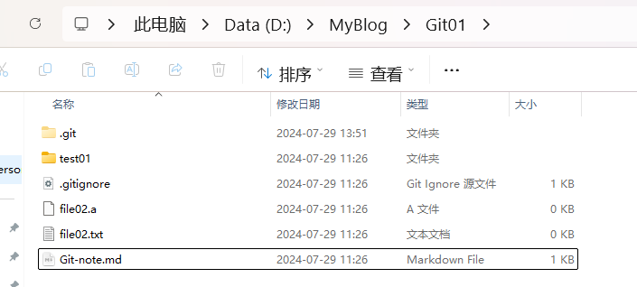

# Git学习笔记

## 3. 基本命令

```bash

LENOVO@LAPTOP-AUK9CS5V MINGW64 /d/MyBlog/Git
$ git init
Initialized empty Git repository in D:/MyBlog/Git/.git/

LENOVO@LAPTOP-AUK9CS5V MINGW64 /d/MyBlog/Git (main)
$ ls -al
total 4
drwxr-xr-x 1 LENOVO 197609 0 Jul 28 13:26 ./
drwxr-xr-x 1 LENOVO 197609 0 Jul 28 13:26 ../
drwxr-xr-x 1 LENOVO 197609 0 Jul 28 13:26 .git/

LENOVO@LAPTOP-AUK9CS5V MINGW64 /d/MyBlog/Git (main)
$ touch Git-note.md

LENOVO@LAPTOP-AUK9CS5V MINGW64 /d/MyBlog/Git (main)
$ git status
On branch main

No commits yet

Untracked files:
  (use "git add <file>..." to include in what will be committed)
        Git-note.md

nothing added to commit but untracked files present (use "git add" to track)

LENOVO@LAPTOP-AUK9CS5V MINGW64 /d/MyBlog/Git (main)
$ git add .

LENOVO@LAPTOP-AUK9CS5V MINGW64 /d/MyBlog/Git (main)
$ git status
On branch main

No commits yet

Changes to be committed:
  (use "git rm --cached <file>..." to unstage)
        new file:   Git-note.md


LENOVO@LAPTOP-AUK9CS5V MINGW64 /d/MyBlog/Git (main)
$ git commit -m "add Git-note.md"
[main (root-commit) 12e6ed3] add Git-note.md
 1 file changed, 0 insertions(+), 0 deletions(-)
 create mode 100644 Git-note.md

LENOVO@LAPTOP-AUK9CS5V MINGW64 /d/MyBlog/Git (main)
$ git status
On branch main
nothing to commit, working tree clean

LENOVO@LAPTOP-AUK9CS5V MINGW64 /d/MyBlog/Git (main)
$ git log
commit 12e6ed3390d4f1c594e28f97a63283ade0197869 (HEAD -> main)
Author: hhy <hhy200319@gmail.com>
Date:   Sun Jul 28 13:32:05 2024 +0800

    add Git-note.md

LENOVO@LAPTOP-AUK9CS5V MINGW64 /d/MyBlog/Git (main)
$ vscode Git-note.md
bash: vscode: command not found

LENOVO@LAPTOP-AUK9CS5V MINGW64 /d/MyBlog/Git (main)
$ code Git-note.md

LENOVO@LAPTOP-AUK9CS5V MINGW64 /d/MyBlog/Git (main)
$ git status
On branch main
Changes not staged for commit:
  (use "git add <file>..." to update what will be committed)
  (use "git restore <file>..." to discard changes in working directory)
        modified:   Git-note.md

no changes added to commit (use "git add" and/or "git commit -a")

LENOVO@LAPTOP-AUK9CS5V MINGW64 /d/MyBlog/Git (main)
$ git add .

LENOVO@LAPTOP-AUK9CS5V MINGW64 /d/MyBlog/Git (main)
$ git status
On branch main
Changes to be committed:
  (use "git restore --staged <file>..." to unstage)
        modified:   Git-note.md


LENOVO@LAPTOP-AUK9CS5V MINGW64 /d/MyBlog/Git (main)
$ git commit -m "update Git-note.md"
[main 9fa6354] update Git-note.md
 1 file changed, 1 insertion(+)

LENOVO@LAPTOP-AUK9CS5V MINGW64 /d/MyBlog/Git (main)
$ git status
On branch main
nothing to commit, working tree clean

LENOVO@LAPTOP-AUK9CS5V MINGW64 /d/MyBlog/Git (main)
$ git log
commit 9fa635483740af6585e3caffee447471cc3847c4 (HEAD -> main)
Author: hhy <hhy200319@gmail.com>
Date:   Sun Jul 28 13:38:02 2024 +0800

    update Git-note.md

commit 12e6ed3390d4f1c594e28f97a63283ade0197869
Author: hhy <hhy200319@gmail.com>
Date:   Sun Jul 28 13:32:05 2024 +0800

    add Git-note.md

LENOVO@LAPTOP-AUK9CS5V MINGW64 /d/MyBlog/Git (main)
$ mkdir test01

LENOVO@LAPTOP-AUK9CS5V MINGW64 /d/MyBlog/Git (main)
$ git status
On branch main
nothing to commit, working tree clean

LENOVO@LAPTOP-AUK9CS5V MINGW64 /d/MyBlog/Git (main)
$ git add .

LENOVO@LAPTOP-AUK9CS5V MINGW64 /d/MyBlog/Git (main)
$ git status
On branch main
nothing to commit, working tree clean

LENOVO@LAPTOP-AUK9CS5V MINGW64 /d/MyBlog/Git (main)
$ cd ./test01

LENOVO@LAPTOP-AUK9CS5V MINGW64 /d/MyBlog/Git/test01 (main)
$ touch test0101.txt

LENOVO@LAPTOP-AUK9CS5V MINGW64 /d/MyBlog/Git/test01 (main)
$ cd ..

LENOVO@LAPTOP-AUK9CS5V MINGW64 /d/MyBlog/Git (main)
$ git status
On branch main
Untracked files:
  (use "git add <file>..." to include in what will be committed)
        test01/

nothing added to commit but untracked files present (use "git add" to track)

LENOVO@LAPTOP-AUK9CS5V MINGW64 /d/MyBlog/Git (main)
$ git add ,
fatal: pathspec ',' did not match any files

LENOVO@LAPTOP-AUK9CS5V MINGW64 /d/MyBlog/Git (main)
$ git add .

LENOVO@LAPTOP-AUK9CS5V MINGW64 /d/MyBlog/Git (main)
$ git status
On branch main
Changes to be committed:
  (use "git restore --staged <file>..." to unstage)
        new file:   test01/test0101.txt


LENOVO@LAPTOP-AUK9CS5V MINGW64 /d/MyBlog/Git (main)
$ git log
commit 9fa635483740af6585e3caffee447471cc3847c4 (HEAD -> main)
Author: hhy <hhy200319@gmail.com>
Date:   Sun Jul 28 13:38:02 2024 +0800

    update Git-note.md

commit 12e6ed3390d4f1c594e28f97a63283ade0197869
Author: hhy <hhy200319@gmail.com>
Date:   Sun Jul 28 13:32:05 2024 +0800

    add Git-note.md

LENOVO@LAPTOP-AUK9CS5V MINGW64 /d/MyBlog/Git (main)
$ git commit -m "add subfolder test01"
[main dbebd7d] add subfolder test01
 1 file changed, 0 insertions(+), 0 deletions(-)
 create mode 100644 test01/test0101.txt

LENOVO@LAPTOP-AUK9CS5V MINGW64 /d/MyBlog/Git (main)
$ git log
commit dbebd7dd0d86ff81975c53acd3d6253a6015c6e0 (HEAD -> main)
Author: hhy <hhy200319@gmail.com>
Date:   Sun Jul 28 14:21:47 2024 +0800

    add subfolder test01

commit 9fa635483740af6585e3caffee447471cc3847c4
Author: hhy <hhy200319@gmail.com>
Date:   Sun Jul 28 13:38:02 2024 +0800

    update Git-note.md

commit 12e6ed3390d4f1c594e28f97a63283ade0197869
Author: hhy <hhy200319@gmail.com>
Date:   Sun Jul 28 13:32:05 2024 +0800

    add Git-note.md

LENOVO@LAPTOP-AUK9CS5V MINGW64 /d/MyBlog/Git (main)
$ git reset --hard 9fa635483740af6585e3caffee447471cc3847c4
HEAD is now at 9fa6354 update Git-note.md

LENOVO@LAPTOP-AUK9CS5V MINGW64 /d/MyBlog/Git (main)
$ git status
On branch main
nothing to commit, working tree clean

LENOVO@LAPTOP-AUK9CS5V MINGW64 /d/MyBlog/Git (main)
$

```

#### 分支

HEAD指明当前处于哪个分支


## 4. 远程仓库

### 4.1 常用的托管服务（远程仓库）

GitHub

### 4.2 创建远程仓库

### 4.3 配置SSH公钥

远程仓库的名字默认设为origin，不要用其他名字。SSH地址会在创建github仓库时给出，复制即可，例如 git@github.com:HHappYoung/Git-note.git

### 4.4 操作远程仓库

#### 4.4.1 添加远程仓库


#### 4.4.5 从远程仓库克隆

克隆：git clone <仓库路径> [本地目录]

- 在`Code`界面，点击绿色的`Code`按钮，获取仓库的SSH地址，


- 在你想要克隆仓库的目标位置打开Git Bash，例如我想把仓库克隆到`D:\MyBlog\Git01\`文件夹下，那我就在`D:\MyBlog\`中打开Git Bash，并执行以下指令（如果没有`Git01`文件夹会自动创建）：

```bash
git clone git@github.com:HHappYoung/Git-note.git Git01
```

输出如下：

```bash
LENOVO@LAPTOP-AUK9CS5V MINGW64 /d/MyBlog
$ git clone git@github.com:HHappYoung/Git-note.git Git01
Cloning into 'Git01'...
remote: Enumerating objects: 16, done.
remote: Counting objects: 100% (16/16), done.
remote: Compressing objects: 100% (7/7), done.
Receiving objects: 100% (16/16), done.
Resolving deltas: 100% (3/3), done.
remote: Total 16 (delta 3), reused 16 (delta 3), pack-reused 0

```

- 查看结果：在 `Git` 和 `Git01` 文件夹下分别打开Git Bash，查看两者的提交记录，发现`Git01`除了没有dev01分支之外（这是因为之前没有把dev01分支推到github上），其他和 `Git` 完全一样，因此称为克隆。

  

#### 4.4.6 从远程仓库抓取和拉取

克隆操作其实只会在把全部代码下载到本地时用到一次，在后续的项目开发过程中，如果要把别人上传到远程仓库的更新下载到本地，则会用到抓取（fetch）和拉取（pull）指令。

- 抓取：git fetch [remote name] [branch name]

  - **抓取指令就是将仓库里的更新都抓取到本地，不会进行合并**

  - 如果不指定远端名称和分支名，则抓取所有分支。

- 拉取：git pull [remote name] [branch name]

  - **拉取指令就是将远端仓库的修改拉到本地并自动进行合并，等同于fetch+merge**

  - 如果不指定远端名称和分支名，则抓取所有并更新当前分支。

现在我有 `Git` 和`Git01` 两个文件夹，可以想象这是两个人在各自的电脑上进行合作开发，我对`Git-note.md`这个文件进行了一些修改，现在把它提交上去。

```bash
LENOVO@LAPTOP-AUK9CS5V MINGW64 /d/MyBlog/Git (main)
$ git status
On branch main
Changes not staged for commit:
  (use "git add <file>..." to update what will be committed)
  (use "git restore <file>..." to discard changes in working directory)
        modified:   Git-note.md

Untracked files:
  (use "git add <file>..." to include in what will be committed)
        md-images/

no changes added to commit (use "git add" and/or "git commit -a")

LENOVO@LAPTOP-AUK9CS5V MINGW64 /d/MyBlog/Git (main)
$ git add .

LENOVO@LAPTOP-AUK9CS5V MINGW64 /d/MyBlog/Git (main)
$ git commit -m "update Git-note.md"
[main dc4a827] update Git-note.md
 4 files changed, 273 insertions(+), 1 deletion(-)
 create mode 100644 md-images/image-20240729112148093.png
 create mode 100644 md-images/image-20240729114320168.png
 create mode 100644 md-images/image-20240729114324667.png

LENOVO@LAPTOP-AUK9CS5V MINGW64 /d/MyBlog/Git (main)
$ git-log
* dc4a827 (HEAD -> main) update Git-note.md
*   079331f (origin/main) Merge branch 'dev01'
|\
| * febbb80 (dev01) add file02.txt
* | a78a786 add .gitignore
|/
* dbebd7d add subfolder test01
* 9fa6354 update Git-note.md
* 12e6ed3 add Git-note.md

LENOVO@LAPTOP-AUK9CS5V MINGW64 /d/MyBlog/Git (main)
$ git push origin main
Enumerating objects: 8, done.
Counting objects: 100% (8/8), done.
Delta compression using up to 20 threads
Compressing objects: 100% (6/6), done.
Writing objects: 100% (6/6), 206.82 KiB | 676.00 KiB/s, done.
Total 6 (delta 1), reused 0 (delta 0), pack-reused 0 (from 0)
remote: Resolving deltas: 100% (1/1), completed with 1 local object.
To github.com:HHappYoung/Git-note.git
   079331f..dc4a827  main -> main

LENOVO@LAPTOP-AUK9CS5V MINGW64 /d/MyBlog/Git (main)
$ git-log
* dc4a827 (HEAD -> main, origin/main) update Git-note.md
*   079331f Merge branch 'dev01'
|\
| * febbb80 (dev01) add file02.txt
* | a78a786 add .gitignore
|/
* dbebd7d add subfolder test01
* 9fa6354 update Git-note.md
* 12e6ed3 add Git-note.md

```

注意两次git-log输出的差别，push之前origin/main在079331f，push之后的origin/main 在dc4a827处，说明最新一次的commit已经推到了远程仓库。现在我们可以将其抓取到`Git01`文件夹下了：

```bash
LENOVO@LAPTOP-AUK9CS5V MINGW64 /d/MyBlog/Git01 (main)
$ git fetch
remote: Enumerating objects: 8, done.
remote: Counting objects: 100% (8/8), done.
remote: Compressing objects: 100% (5/5), done.
remote: Total 6 (delta 1), reused 6 (delta 1), pack-reused 0
Unpacking objects: 100% (6/6), 206.80 KiB | 314.00 KiB/s, done.
From github.com:HHappYoung/Git-note
   079331f..dc4a827  main       -> origin/main

LENOVO@LAPTOP-AUK9CS5V MINGW64 /d/MyBlog/Git01 (main)
$ git-log
* dc4a827 (origin/main, origin/HEAD) update Git-note.md
*   079331f (HEAD -> main) Merge branch 'dev01'
|\
| * febbb80 add file02.txt
* | a78a786 add .gitignore
|/
* dbebd7d add subfolder test01
* 9fa6354 update Git-note.md
* 12e6ed3 add Git-note.md

```

git-log的输出显示最新一次的commit（dc4a827）已经被抓取到了`Git01`下，但是文件夹里暂时还看不到变化：



将远程分支merge到本地的main分支（这个就是之前讲的合并操作，远程分支也是一个分支）：

```bash
LENOVO@LAPTOP-AUK9CS5V MINGW64 /d/MyBlog/Git01 (main)
$ git merge origin/main
Updating 079331f..dc4a827
Fast-forward
 Git-note.md                           | 274 +++++++++++++++++++++++++++++++++-
 md-images/image-20240729112148093.png | Bin 0 -> 162640 bytes
 md-images/image-20240729114320168.png | Bin 0 -> 57983 bytes
 md-images/image-20240729114324667.png | Bin 0 -> 57983 bytes
 4 files changed, 273 insertions(+), 1 deletion(-)
 create mode 100644 md-images/image-20240729112148093.png
 create mode 100644 md-images/image-20240729114320168.png
 create mode 100644 md-images/image-20240729114324667.png
 
LENOVO@LAPTOP-AUK9CS5V MINGW64 /d/MyBlog/Git01 (main)
$ git-log
* dc4a827 (HEAD -> main, origin/main, origin/HEAD) update Git-note.md
*   079331f Merge branch 'dev01'
|\
| * febbb80 add file02.txt
* | a78a786 add .gitignore
|/
* dbebd7d add subfolder test01
* 9fa6354 update Git-note.md
* 12e6ed3 add Git-note.md
```

可以看到main分支已经移动到了dc4a827处，说明合并成功，`Git01`下的文件也已经相应地发生了变化：


事实上，上述fetch+merge的操作可以合并成拉取命令pull：
